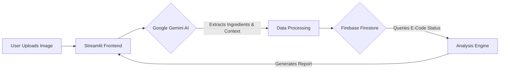

# ☪️ HALAI™ - Halal Artificial Intelligence Scanner

<div align="center">
  
  <br>
  <h3>Scan. Detect. Consume with Confidence.</h3>
  <p>Built for <b>KitaHack 2026</b> by Team <b>4-midable</b></p>
</div>

---

## 📖 Table of Contents
- Introduction
- The Problem
- The Solution
- Key Features
- System Architecture
- Tech Stack
- Project Structure
- Installation & Setup
- Usage Guide
- Future Roadmap
- Team

---

## 💡 Introduction

**HALAI™** is an advanced AI-powered food scanner designed to be the "Digital Halal Auditor" in your pocket. Built for the modern Muslim consumer, HALAI helps instantly identify **Haram** (prohibited) and **Syubhah** (doubtful) ingredients in food products, especially when an official Halal certification logo is missing.

By leveraging **Google Gemini's Multimodal AI** for sophisticated context-aware OCR and a verified **Firebase** database of E-codes, HALAI provides an immediate safety verdict. This empowers users to navigate global food markets with confidence, ensuring their consumption aligns with religious requirements and health values (supporting **UN SDGs 3 & 12**).

## 🚩 The Problem: The "Missingn Halal Logo" Dilemma

The primary challenge for Muslim consumers isn't just identifying bad ingredients—it's the uncertainty found in everyday shopping scenarios:

*   **The Missing Logo:** Many imported products or niche local brands are "Muslim-friendly" in theory but lack an official Halal logo due to high certification costs or different regional standards.
*   **Cryptic Labeling:** Even without a logo, consumers try to read labels but are blocked by "E-code" puzzles (e.g., *E471*, *E120*) or scientific aliases (*Cochineal*, *L-Cysteine*).
*   **The "Syubhah" Trap:** Some ingredients are "chameleon" ingredients. For example, *E471* can be 100% plant-based (Halal) or animal-derived (Syubhah/Haram). Without a logo, the consumer has no way to verify the source.
*   **Decision Fatigue:** Spending 10 minutes Googling every ingredient in a grocery aisle is frustrating and impractical.

## 🚀 The Solution: Instant Verification

HALAI acts as a bridge between a raw ingredient list and a definitive Halal status, providing clarity where a physical logo is absent.

1.  **Snap & Decode:** User uploads a photo of the ingredient label. The AI bypasses the need for a logo by reading the actual chemical makeup of the product.
2.  **Contextual Intelligence:** Unlike a simple keyword search, HALAI understands context. If the AI sees "E471" but also detects the words "Soy-based" or "Vegetable origin" nearby, it intelligently upgrades the status from Syubhah to Halal.
3.  **Cross-Reference:** The system instantly matches extracted text against a curated Firestore database of E-codes and additives.
4.  **Instant Verdict:** Within seconds, the user receives a color-coded report and a Safety Score, turning a confusing block of text into a simple "Yes," "No," or "Caution."

## ✨ Key Features

*   **📸 AI-Powered OCR**: Uses Google Gemini 2.5 Flash Lite to read text from images, even on curved or crinkled packaging.
*   **🧠 Context Awareness**: Unlike basic text search, HALAI understands context. If E471 is labeled "Plant-based", HALAI marks it as **Halal** instead of **Syubhah**.
*   **🔍 Comprehensive E-Code Database**: A Firestore-backed library of common additives, preservatives, and E-codes with their Halal status.
*   **🚦 Visual Risk Levels**:
    *   🔴 **Haram**: Strictly prohibited (e.g., Pork, Alcohol, Carmine).
    *   🟡 **Syubhah**: Doubtful/Needs verification (e.g., Gelatin, E471 without source).
    *   🟢 **Halal**: Safe to consume.
*   **📊 Safety Score**: Generates a percentage-based safety score for quick decision-making.
*   **📱 Mobile-First Design**: Optimized for mobile browsers with a responsive UI.
*   **📝 Community Reporting**: Users can flag incorrect information or missing ingredients directly within the app.

## 🏗️ System Architecture

The application follows a modern, cloud-native architecture:



1.  **Frontend**: Streamlit handles the UI, image upload, and state management.
2.  **AI Layer**: Google Gemini processes the image to extract structured JSON data containing ingredient codes and context.
3.  **Database Layer**: Firebase Firestore stores the "Truth List" of E-codes and their default statuses.
4.  **Logic Layer**: Python scripts merge AI findings with database records to determine the final verdict.

## 🛠️ Tech Stack

| Component | Technology | Purpose |
| :--- | :--- | :--- |
| **Frontend** | Streamlit | Interactive web interface and dashboard. |
| **AI Model** | Google Gemini 2.5 Flash | Multimodal image analysis and OCR. |
| **Database** | Firebase Firestore | NoSQL database for ingredient data. |
| **Backend Logic** | Python 3.10+ | Data processing and API integration. |
| **Image Processing** | Pillow (PIL) | Image manipulation before sending to AI. |

## 📂 Project Structure

Here is an overview of the project's file organization:

```text
HALAI/
├── app.py                 # Main application file (Streamlit frontend + Logic)
├── seed.py                # Script to populate Firestore with initial E-code data
├── requirements.txt       # List of Python dependencies
├── .env                   # Environment variables (API Keys - Not uploaded to Git)
├── firebase_key.json      # Firebase Service Account Key (Not uploaded to Git)
├── logohalai.jpg          # Project logo image
├── README.md              # Project documentation
└── License                # MIT License file
```

### File Descriptions
*   **`app.py`**: The heart of the application. It contains the Streamlit UI code, the integration with Google Gemini for image analysis, and the logic to query Firebase Firestore.
*   **`seed.py`**: A utility script run once to upload the comprehensive list of E-codes (Halal, Haram, Syubhah) to the database.
*   **`requirements.txt`**: Ensures all developers and the deployment server have the necessary libraries installed.
*   **`.env`**: Stores sensitive keys like `GEMINI_API_KEY` securely.
*   **`firebase_key.json`**: Authentication file required for the app to talk to the Google Firebase database.

## 💻 Installation & Setup

Follow these steps to run HALAI locally.

### Prerequisites
*   Python 3.8 or higher
*   A Google Cloud Project with Gemini API enabled
*   A Firebase Project with Firestore enabled

### 1. Clone the Repository
```bash
git clone https://github.com/luqmnnnn/HALAI.git
cd HALAI
```

### 2. Install Dependencies
```bash
pip install -r requirements.txt
```

### 3. Configure Environment Variables
Create a `.env` file in the root directory:
```ini
GEMINI_API_KEY=your_google_gemini_api_key_here
```

### 4. Setup Firebase
1.  Go to your Firebase Console > Project Settings > Service Accounts.
2.  Generate a new private key.
3.  Save the file as `firebase_key.json` in the project root folder.
4.  (Optional) Run the seeder script to populate the database:
    ```bash
    python seed.py
    ```

### 5. Run the App
```bash
streamlit run app.py
```

## 📖 Usage Guide

1.  **Launch the App**: Open the local URL provided by Streamlit (usually `http://localhost:8501`).
2.  **Upload Label**: Click "Browse files" (or select "Take Photo" on mobile) to scan a food ingredient label.
3.  **Scan**: Click the "Scan Ingredients" button.
4.  **Review**:
    *   Check the **Safety Score**.
    *   Read the **Verdict** (Halal, Syubhah, or Haram).
    *   Expand the **Detailed Breakdown** to see specific ingredients.
5.  **Share**: Use the "Share Result" button to send findings via WhatsApp.

## 🗺️ Future Roadmap

*   [ ] **Barcode Scanning**: Integrate barcode lookup for faster results on known products.
*   [ ] **Multi-Language Support**: Support for Malay, Arabic, and Indonesian labels.
*   [ ] **User Accounts**: Save scan history and favorite products.
*   [ ] **Offline Mode**: Local caching of the E-code database for low-connectivity areas.

## 👥 Team

**Team 4-midable**
*   **Luqman** - Team Leader
*   **Iman** - Team Member
*   **Sofea** - Team Member
*   **Afiq** - Team Member

---

<div align="center">
  <sub>Built with ❤️ for the Muslim Community</sub>
</div>
